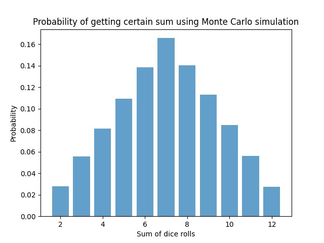

# goit-algo-fp

# Використання методу Монте-Карло

Програмно реалізовано алгоритм для моделювання кидання двох ігрових кубиків і побудови таблиці сум та їх імовірностей за
допомогою методу Монте-Карло.

Код імітує велику кількість кидків кубиків (100000), обчислює суми чисел, які випадають на кубиках,
підраховує, скільки разів кожна можлива сума з’являється у процесі симуляції, і визначає ймовірність кожної можливої
суми.

Створено таблицю та графік, які відображають ймовірності кожної суми, виявлені за допомогою методу Монте-Карло.

| Сума чисел на кубиках | Ймовірність |
|-----------------------|-------------|
| 2                     | 0.0270      |
| 3                     | 0.0566      |
| 4                     | 0.0822      |
| 5                     | 0.1113      |
| 6                     | 0.1396      |
| 7                     | 0.1663      |
| 8                     | 0.1410      |
| 9                     | 0.1109      |
| 10                    | 0.0824      |
| 11                    | 0.0548      |
| 12                    | 0.0280      |

Наступна таблиця створена за допомогою аналітичного методу (для порівняння наших результатів)

| Сума | Ймовірність   | 
|------|---------------|
| 2    | 2.78% (1/36)  |
| 3    | 5.56% (2/36)  |
| 4    | 8.33% (3/36)  |
| 5    | 11.11% (4/36) |
| 6    | 13.89% (5/36) |
| 7    | 16.67% (6/36) |
| 8    | 13.89% (5/36) |
| 9    | 11.11% (4/36) |
| 10   | 8.33% (3/36)  |
| 11   | 5.56% (2/36)  |
| 12   | 2.78% (1/36)  |

<h3>Висновки:</h3>

- метод Монте-Карло є стохастичним методом, що використовує випадкові експерименти для апроксимації аналітичних
  розв'язків. Правильність розрахунків за допомогою методу Монте-Карло можна оцінити порівнянням отриманих результатів
  із тими, які можна отримати аналітично.
- результати близькі, це підтверджує правильність наших симуляцій. В результаті методу Монте-Карло може бути трохи
  варіацій, але зі збільшенням кількості симуляцій точність зазвичай зростає.